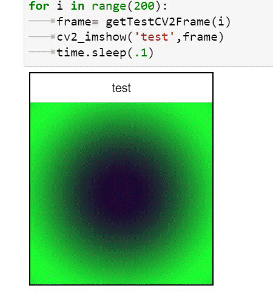

# opencv_jupyter_ui
As you know it is not possible to use `cv2.imshow` in the remote jupyter notebook or colab.
This is the replacement of `cv2.imshow` for jupyter. you need only to replace `cv2.imshow` to `cv2_imshow`. It will works in jupyter or python.

# Installation
```
pip install opencv_jupyter_ui
```

# Usage
## import
```
from opencv_jupyter_ui import cv2_imshow
```
## Showing Frame
It is exactly like `cv2.imshow` you just need to change `.` to `_`.
```
cv2_imshow('test',frame)
```
### more options for showing frame
you can specify target width or height:
```
cv2_imshow('test',frame,width=100) # scale down/up your image to fit this width
cv2_imshow('test',frame,100) similar to previous example
cv2_imshow('test',frame,height=150) # scale down/up your image to fit this height
cv2_imshow('test',frame,width=100,height=150) # skretch your image to this size
cv2_imshow('test',frame,color_space='rgb') # color_space=rgb or bgr, default: bgr
```
Please note that you can also put CSS string instead e.g., `width='100%'`

## reseting and destroying windows:
from opencv_jupyter_ui import cv2_destroyAllWindows
Don't forget to add the following line where you clear the output
```
cv2_destroyAllWindows()
```
# Example
```
from opencv_jupyter_ui import cv2_imshow

def getTestCV2Frame(i):
	import numpy as np
	x = np.linspace(-1, 1, 200)
	y = np.linspace(-1, 1, 200)
	x_grid, y_grid = np.meshgrid(x, y)
	blue_channel = np.array(np.sin(x_grid**2 + y_grid**2) * 255, dtype=np.int32)
	red_channel = (np.zeros_like(blue_channel) + 200*i)%222
	green_channel = np.zeros_like(blue_channel) + 50
	return np.stack((red_channel, blue_channel, green_channel), axis=2)

import time
for i in range(200):
	frame= getTestCV2Frame(i)
	cv2_imshow('test',frame)
	time.sleep(.1)

cv2_destroyAllWindows() #optinal only needed if you don't run it in notebook
```
Output:



# running in normal python
if it is not in jupyter it will display an opencv window. please don't forget to call `cv2_destroyAllWindows()` if it is not in jupyter


# COLAB 
for google colab please add the following codes and restart all the cells.
```
!pip install -q ipycanvas==0.11
from google.colab import output
output.enable_custom_widget_manager()

```
